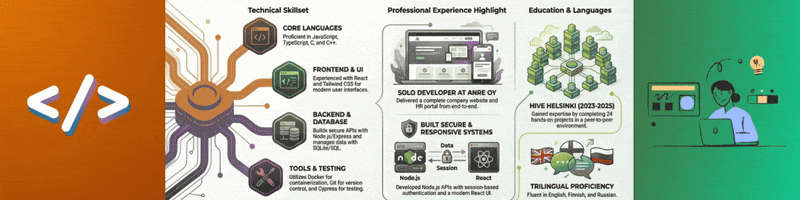

## ❗- Welcome to My GitHub -

- 🙋 I’m Elena!
- 🎒 I gaduated from <a href="https://www.hive.fi/en/" target="_blank">Hive Helsinki Code School</a> (<a href="https://www.42network.org" target="_blank">42Network</a>), where I mastered programming and problem-solving. Currently, I am developing my web development skills with React, JavaScript, Node.js as a Full-Stack Developer Intern at Anre Oy. 

- 💬 Feel free to browse and connect!
- 📧 elena.polkhovski@gmail.com
- 📫  <a href="https://fi.linkedin.com/in/elena-polkhovski-58635026">My LinkedIn Profile</a>

## 🖥️ - Stack -

<!--
**lenkras/lenkras** is a ✨ _special_ ✨ repository because its `README.md` (this file) appears on your GitHub profile.

Here are some ideas to get you started:

- 🔭 I’m currently working on ...
- 🌱 I’m currently learning ...
- 👯 I’m looking to collaborate on ...
- 🤔 I’m looking for help with ...
- 💬 Ask me about ...
- 📫 How to reach me: ...
- 😄 Pronouns: ...
- ⚡ Fun fact: ...
-->
